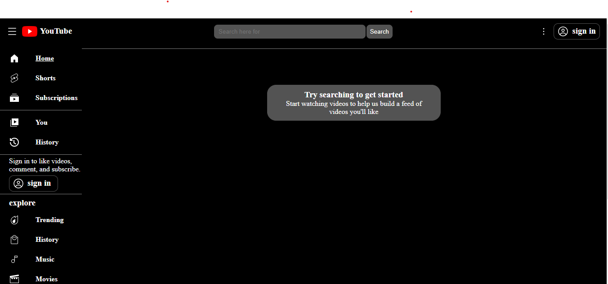
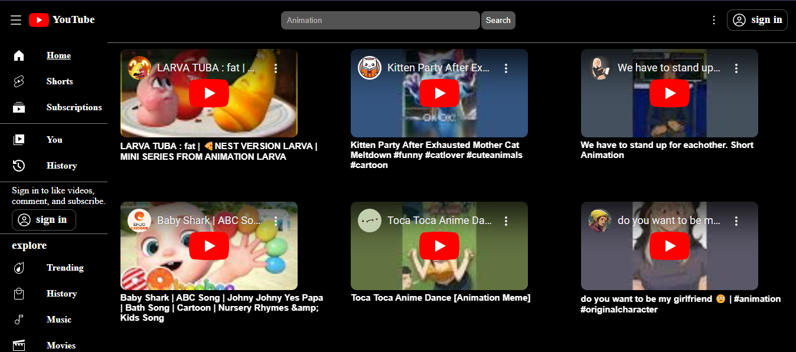
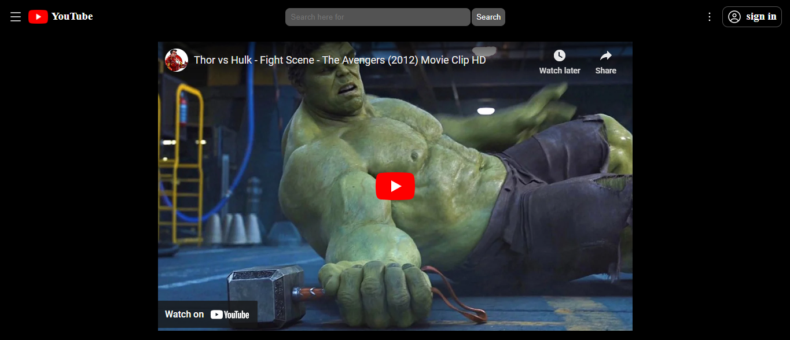

# YouTube Clone

## Overview
This project is a simplified clone of YouTube, built to demonstrate my skills in HTML, CSS, and JavaScript. The application allows users to search for videos using the YouTube API, view video details, and play videos directly on the site.

## Features
- **Responsive Design**: The application is designed to be fully responsive, ensuring a seamless experience across devices.
- **Search Functionality**: Users can search for videos using the YouTube API.
- **Video Playback**: Videos can be played directly on the site.
- **Navigation**: The site includes navigation options similar to YouTube, such as Home, Shorts, Subscriptions, and History.
- **User Profile**: A basic user profile section for future expansion.

## Technologies Used
- HTML
- CSS
- JavaScript
- YouTube API

## Screenshots
### Home Page


### Search Results


### Video Playback


## Live Demo
Check out the live demo of the project: [YouTube Clone](https://youtube-clone-ani.netlify.app)

## Installation
1. Clone the repository:
    ```bash
    git clone https://github.com/Aniketgarate11/youtube-clone.git
    ```
2. Navigate to the project directory:
    ```bash
    cd youtube-clone
    ```
3. Open `index.html` in your preferred web browser.


## Project Structure
- `index.html`: The main HTML file.
- `video.html`: The HTML file for video playback.
- `style.css`: The main CSS file for styling the application.
- `script.js`: The main JavaScript file for functionality.

## Acknowledgements
- [YouTube API](https://developers.google.com/youtube/v3)
- Icons from [Icons8](https://icons8.com)

## Contact
- [Aniket Garate](https://github.com/Aniketgarate11)
- [garateaniket11@gmail.com](mailto:garateaniket11@gmail.com)


